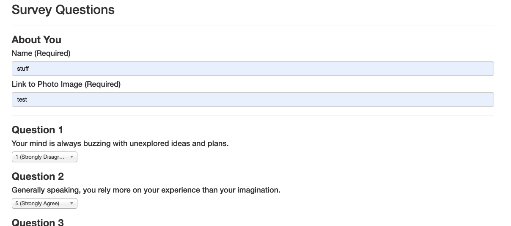

# FriendFinder

The Friend Finder application is basically a dating app, but for makin' Old 80's TV Shows buddies. This full-stack site will take in users' surveys, then compare their answers with those from other users. The app will then display the name and picture of the user with the best overall match.

This project was created as an assignment for the SMU Coding Bootcamp.

# Getting Started

<a href="https://friendfinder80s.herokuapp.com/">View the finished product on Heroku.</a>

# Screen Shots

 
# Index page

 
# Survey page

 
# Submit page

# Technologies Used

- HTML
- CSS
- Javascript
- Express
- Node
- JSON
